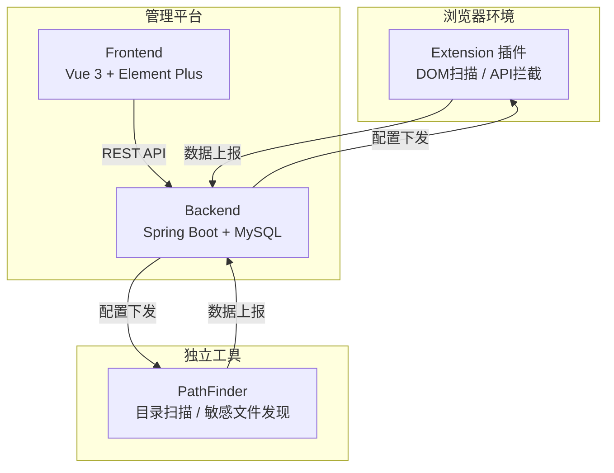

# PentaMind 项目架构

## 整体架构



## 模块说明

| 模块 | 路径 | 定位 | 是否可独立运行 |
|------|------|------|:-:|
| **Extension** | `extension/` | 浏览器插件，注入页面进行功能点发现和 API 拦截 | ✅ |
| **PathFinder** | `pathfinder/` | 独立 Node.js 工具，目录爆破和敏感文件扫描 | ✅ |
| **Platform Frontend** | `platform/frontend/` | Vue 3 管理面板，统一展示和操控各模块 | ⚠️ 需后端 |
| **Platform Backend** | `platform/backend/` | Spring Boot API 服务，数据存储和插件调度 | ⚠️ 需数据库 |

## 插件独立性原则

每个插件**可以完全脱离平台独立工作**：

1. **Extension** - 直接在 Chrome 中加载 `extension/` 目录即可使用
2. **PathFinder** - 直接 `node src/cli.js -t <url>` 或 `npm start` 启动 Web UI

当平台运行时，插件通过以下接口实现数据回连：

```
POST /api/plugin/report     ← 上报扫描结果
GET  /api/plugin/config/:name ← 拉取最新配置
POST /api/plugin/heartbeat  ← 心跳保活
```

## 数据库设计

| 表名 | 用途 |
|------|------|
| `pm_target` | 扫描目标（URL、类型、状态、风险等级） |
| `pm_scan_task` | 扫描任务（类型、进度、结果JSON） |
| `pm_vulnerability` | 漏洞记录（类型、严重度、Payload、证据） |
| `pm_plugin` | 插件状态（版本、在线状态、心跳时间） |

## 开发协作

- 各模块互不越界，修改前确认负责归属
- 每次提交需同步更新对应模块的 README 或文档
- 独立模块的 README 包含其自身的启动和使用方式
